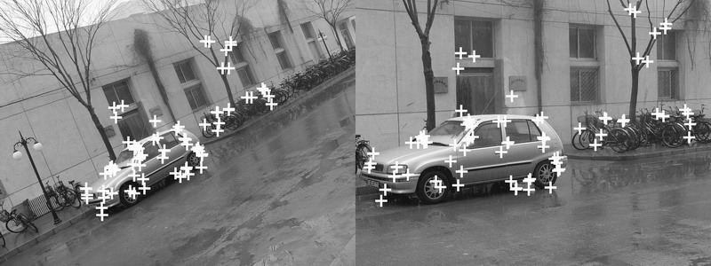

# Interest Points Detection

In this method interest points are playing an important role to pave the way to normalized cross-correlation process. Matching images via normalized cross-correlation has its limits including scaling, rotation and translation of the images being compared for many applications as illustrated in the figure.

First row of plots contain the patch as it is directly removed out from the source picture so the similarity measure is from where it is extracted is very high and correctly pointed out by red dot.

For the second row the patch is scaled down to half it's original size and it resulted in a faulty measurement.

---

The method proposed extract interest points between images and assigning them scale and direction by matching them.

