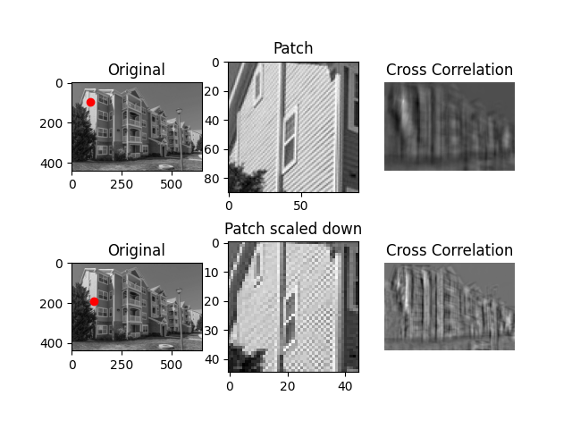
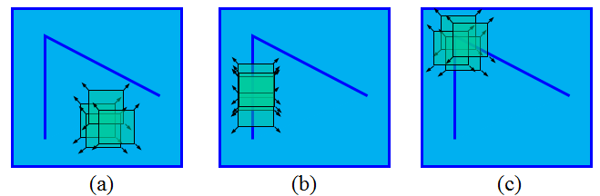

# Interest Points Detection

In this method interest points are playing an important role to pave the way to normalized cross-correlation process. Matching images via normalized cross-correlation has its limits including scaling, rotation and translation of the images being compared for many applications as illustrated in the figure.

---

First row of plots contain the patch as it is directly removed out from the source picture so the similarity measure is from where it is extracted is very high and correctly pointed out by red dot.

For the second row the patch is scaled down to half it's original size and it resulted in a faulty measurement.

---

## Corner Detection Algorithm (Harris)

The method proposed extract interest points using Harris-Laplacian detector between images and assigning them scale and direction by matching them.

**Harris corner detection** algorithm works by measuring differences in intensity values between a sliding window and the reference. Window is moved to all neighbourhoods to find the change of the intensity for that displacement.

---

### Formulation of the Harris Corner Detector

The window function is either a rectangular window or a Gaussian window.

The window which carries bigger varation in intensity means a corner for this reason we need to maximize E(u, v)

Using taylor expansion on the right side of the formula gets us

Putting all in matrix form

----

Depending on the R value we can come to these conclusions

